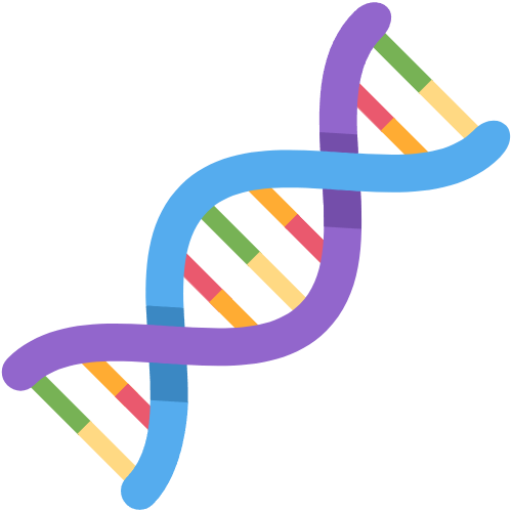
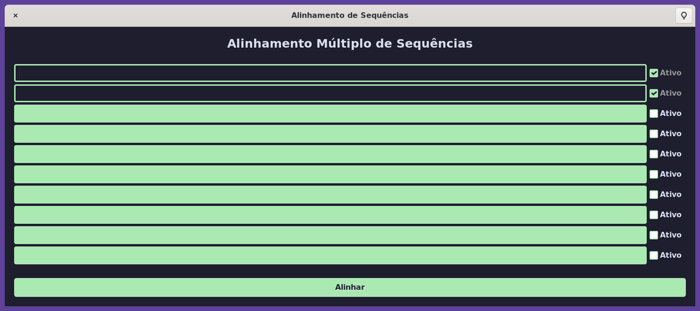
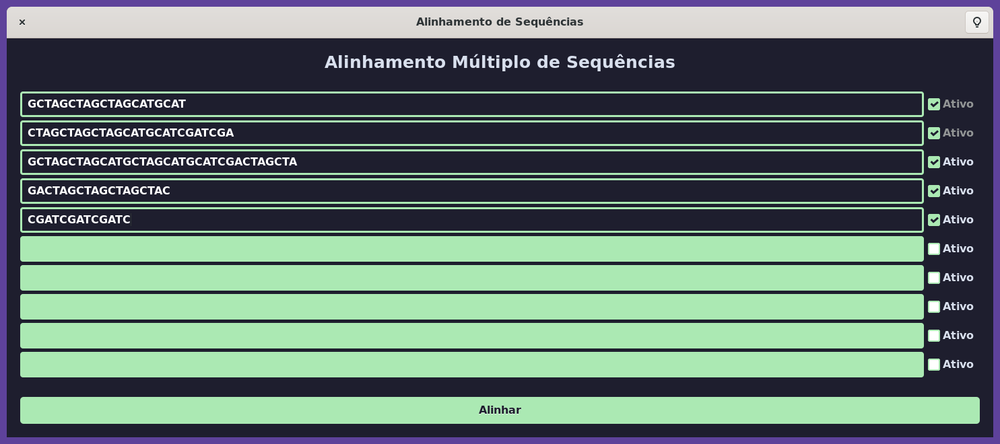
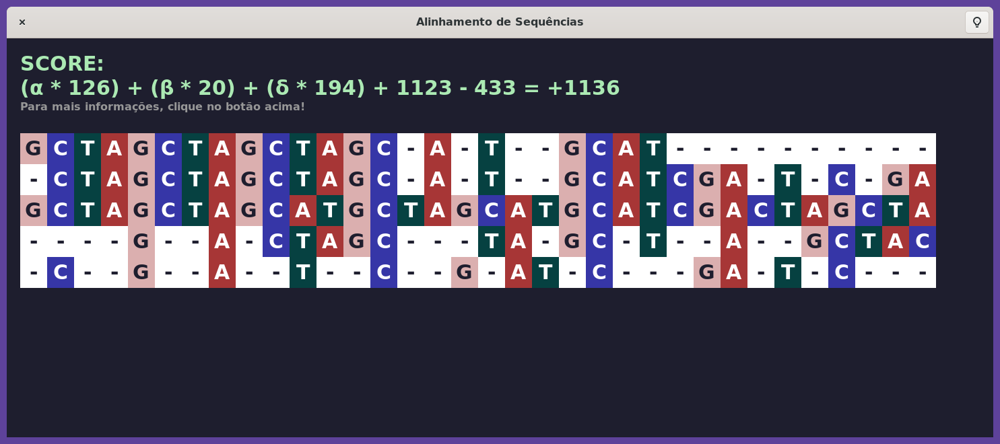
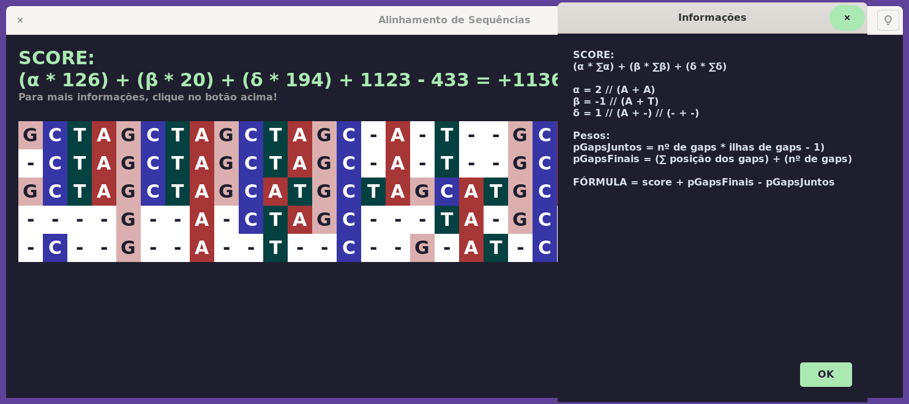

<br>
<div align="center">
  <p>
    
  </p>

# 🧬 Alinhamento Múltiplo de DNA, projeto de Estrutura de Dados 👨‍🏫

</div>

<p align="center">
  
  
  <a href="https://github.com/abacaxiguy" target="_blank"></a>
</p>

<br>

<p align="center">
  
  
  
  
  
</p>

---

## 📖 Sobre o projeto

O projeto possui 3 partes, cada uma possui algo diferente, mas todas servem para o mesmo propósito: alinhar múltiplas sequências de DNA de no máximo 10 sequeências de 100 caracteres.

<details>
    <summary>📝 Mais detalhes sobre como funciona</summary>
    <br>
    Essas foram as instruções dadas para o projeto:

    Implemente um programa que realiza a operação de alinhamento múltiplo de DNA com
    uma estrutura que permita a o alinhamento de 10 sequências com tamanho igual à
    100. 
    
    O alinhamento de múltiplos DNA pode ser resumido da seguinte forma: dado um
    conjunto de DNA (cadeias de bases nitrogenadas) Sinput ={s1,s2,..,si,..} de
    tamanhos variando de 1 até m∈N (Números Naturais), e os pesos α,β,δ∈Q (Números
    Racionais) para expressar as seguintes situações:

        • α expressa a relevância do alinhamento de x pares de bases nitrogenadas iguais
    ocupando a mesma posição nas cadeias do conjunto de entrada

        • β para o alinhamento de y pares de bases nitrogenadas diferentes ocupando a
    mesma posição nas cadeias do conjunto de entrada 

        • δ para o alinhamento de z pares formados por um gap (buraco representado pelo
    símbolo “-”) e uma base nitrogenada ocupando a mesma posição nas cadeias do
    conjunto de entrada. 
    
    O alinhamento de Sinput é um conjunto Soutput = { r1, r2,.., ri,..}, formado por seqüências 
    de tamanho m, construídas pela inserção de buracos nas seqüências dos
    elementos do conjunto Sinput, tal que para toda posição i variando de 1 à m, o
    valor da fórmula score = αx+βy+δz seja máximo, e que para cada seqüência sj
    pertencente ao conjunto Sinput exista uma única seqüência rj no conjunto
    Soutput, cuja remoção dos gaps de rj reproduza a seqüência sj dada.
</details>

- ``Projeto 1:`` Feito em C, sem estrutura de dados, CLI.
- ``Projeto 2:`` Feito em C, com estrutura de dados, CLI.
- ``Projeto 3:`` Feito com C, usando o GTK, com estrutura de dados, Desktop App.

---

## 🚀 Como executar

Para rodar o primeiro e o segundo projeto na sua máquina local, você só precisa clonar o repositório e compilar o arquivo em C e executar o arquivo compilado.

```sh
# Na pasta do projeto que queira rodar, compile o arquivo
gcc main.c -o main

# Depois, execute o arquivo compilado
./main
```

Para rodar o terceiro projeto, você precisa ter o GTK instalado na sua máquina, e depois seguir os passos acima.

---

## 🤝 Contribuições

Contribuições, issues e feature requests são muito bem vindas!<br />Sinta-se à vontade checar a [página de issues](https://github.com/abacaxiguy/alinhamento-multiplo-dna/issues).

---

## 📜 Licença

Copyright © 2023 [João Lucas](https://github.com/abacaxiguy) 🤝 [Iasmin Borba](https://github.com/IasminBorba) 🤝 [José Alexandre](https://github.com/ZanderAlec) .<br />
This project is licensed under the [MIT](https://github.com/abacaxiguy/alinhamento-multiplo-dna/blob/main/LICENSE) license.

---

## 👩‍💻 Desenvolvedores 👨‍💻

| [<br><sub>João Lucas</sub>](https://github.com/abacaxiguy) |  [<br><sub>Iasmin Borba</sub>](https://github.com/IasminBorba) | [<br><sub>José Alexandre</sub>](https://github.com/ZanderAlec) |
| :---: | :---: | :---: | 
